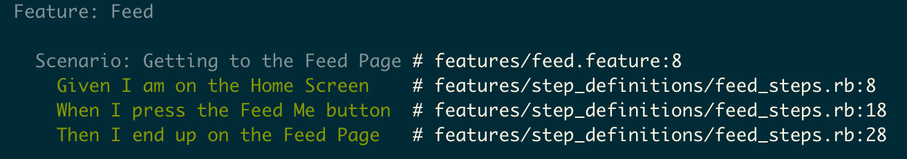

# Android Feature Specifications

[Cucumber](https://cucumber.io/) is a [behavior-driven development (BDD)](http://en.wikipedia.org/wiki/Behavior-driven_development) framework that allows users to describe app behavior in plain text. Cucumber works by defining [feature specs in Gherkin](https://cucumber.io/docs/reference#gherkin) and then writing Ruby [step definitions](https://cucumber.io/docs/reference#step-definitions) to translate plaintext Gherkin steps into actions. For more information on Cucumber, see the docs linked above or the [Originate Blog Post](http://blog.originate.com/blog/2014/12/02/high-level-cucumber) on User-level Feature Specs With Cucumber.

For mobile applications, step definitions issue [Appium](http://appium.io) commands to control mobile devices.

## Setup

In order to use Cucumber and Appium, we'll first need to install a couple of dependencies.

### Ruby Gems
```ruby
source 'http://rubygems.org'

gem 'appium_lib'
gem 'cucumber'

```

Add the above to a Gemfile in your app's root directory and run `bundle install`. If you don't have bundler already installed on your computer, then run `gem install bundler` first. This will give us the gems we need to start working with [Cucumber](https://rubygems.org/gems/cucumber) and [Appium](https://rubygems.org/gems/appium_lib) in Ruby.

### Appium Server

Appium offers both a standard command-line server and an OS X Appium desktop application (which wraps their server up in a nice GUI and comes bundled with a useful inspector tool). Only the command-line server is necessary, however the GUI offers some additional features that may prove useful.

* Download the command-line server via the [Node.js](https://nodejs.org/en/) package manager [npm](https://www.npmjs.com). Appium can be installed globally by running `npm install -g appium`.
* OS X users should also download the app by clicking the ['Download Appium' button on their website](http://appium.io/). Documentation on how to use the GUI and the built-in inspector tool can be found [here](https://github.com/appium/appium-dot-app/blob/master/README.md).

## Cucumber & Appium Example

Describing how to write feature specs with Cucumber and Appium is no easy task. Specifications can vary greatly from project to project. As such, we'll use a [simple example](feature_specifications_example.md) to show you how it works. Check out the [official Ruby documentation](https://github.com/appium/ruby_lib/blob/master/docs/android_docs.md) for a full list of Appium commands.

### Known Appium Issues

* As of June 1, 2015, the `scroll_to(text)` method is broken on Android and fails to scroll to the appropriate element.
* The `swipe` method works based off of `:start_x`, `:start_y`, `end_x` and `:end_y` coordinates which vary greatly from device to device. A swipe that lands you in the correct spot on your local emulator may not work as well on CircleCI.

## Running Locally

To run your feature specs locally, simply open a separate shell and start the app in the background.

```bash
appium &
```

Then run the Cucumber features from your project's root directory.

```bash
cucumber
```

## Running on CircleCI

Once you have your tests up and running locally, it is time to start adding them to your CircleCI build.

### Machine

By default, CirleCI uses either [1.9.3-p448 or 1.8.7-p358](https://circleci.com/docs/language-ruby-on-rails#version) as their default version of Ruby. If your project necessitates a [specific version](https://circleci.com/docs/environment#ruby) of Ruby, you can manually specify prior to the build. In our experience, the Appium feature steps work best on Ruby 2.2, so add the following to your circle file.

```yml
machine:
  ruby:
    version: 2.2.0
```

### Dependencies

In order to run our feature specs, add the following to your circle file to install Appium and the Ruby gems that are listed in our Gemfile.

```yml
dependencies:
  pre:
    - npm install -g appium
    - bundle install
```

### Tests

```yml
test:
  pre:
    - appium:
        background: true
  override:
    - cucumber
```

The above snippet starts the Appium server in the background and runs the cucumber feature specs.

Your CircleCI environment should now be ready to run your feature specs each time there is a new build.

## Conclusion

The above guide and the linked [feature specification example](feature_specifications_example.md) should be enough to get you started writing integration tests with Cucumber and Appium. Hopefully, if all goes well, you will be seeing green!



### Additional Resources

* The complete feature spec code built from this example can be found [here](../files/code/featureSpecs).
* [Appium Inspector Guide](https://github.com/appium/appium-dot-app/blob/master/README.md)
* [Official Ruby Appium Docs](https://github.com/appium/ruby_lib/blob/master/docs/android_docs.md)
* [Official Cucumber Docs](https://cucumber.io/docs/reference)
