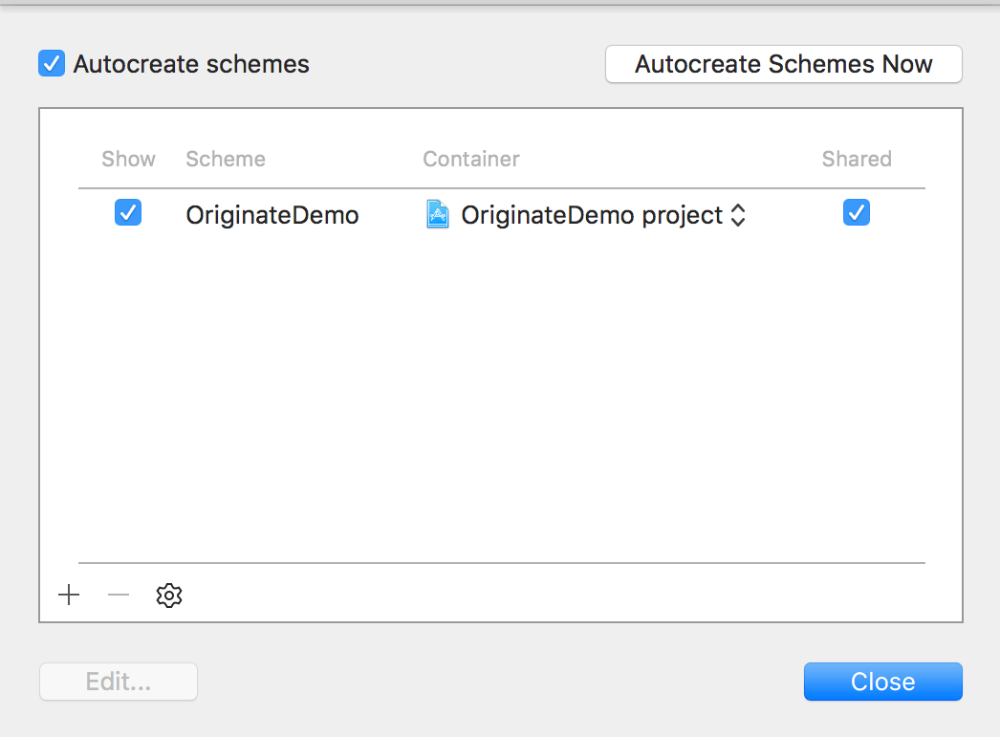

# Setting up iOS Continuous Integration with CircleCI

By the end of this short guide, CircleCI should be able to test and build your iOS project.

## CircleCI setup

1. Login to [CircleCI](https://circleci.com/)
2. [Add a new project](https://circleci.com/add-projects) (Must be logged in to CircleCi)
  * Select GitHub account and find the iOS repo
  * Press **Build project** to get started
3. As of August 2015, you may see the following warning:

  > Warning: CircleCI has located an Xcode project or workspace in this repository. CircleCI is currently offering beta access to our iOS build system. Please contact support if you would like access. Once you have beta access, you can enable iOS builds in the 'Experimental Settings' section of the 'Project Settings' page.
  * If the GitHub account is already opted-in to CircleCI's iOS beta access program, then simply turn on iOS building for your repo
    * **Project Settings** > **Experimental Settings** > **Build iOS project**: ***On***

## Project setup

1. Ensure that the main target's scheme is shared for CircleCI to build.
   * Xcode > Click scheme button > **Manage Schemes...**
   * 
2. CircleCI can make some inferences at this point and test and build simple projects. Most projects will require a customized **circle.yml** file located at the project root.
3. Use our [**circle.yml**](../../files/circle.yml) file as a template to get started.
   * This particular circle.yml will run static analysis via a helper script [**analyze.sh**](../../files/analyze.sh). Place it here in your project — `./scripts/CircleCI/analyze.sh`.
   * Replace `<YOUR_APP>` placeholders with your app's name in these template files.

## Build!

After completing the previous steps, CircleCI should now be able to build and test your project every time a branch is pushed up to GitHub. Try it out!

## Other resources

* [**Configuring CircleCI**](https://circleci.com/docs/configuration)
* [**Sample circle.yml file**](https://circleci.com/docs/config-sample)
* [**iOS applications on CircleCI**](https://circleci.com/docs/ios)

