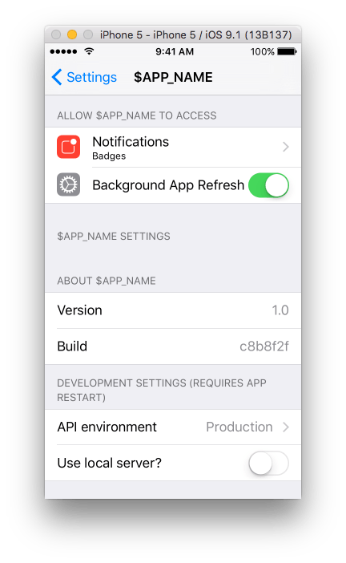

# Settings.bundle

The `Settings.bundle` defines the contents of an application's global settings page.
The app's version and acknowledgements are commonly listed here.

During development, it's also useful to include some app customization settings here. Examples include:

* Switching the server environment (development, staging, production)
* Enabling or disabling app-specific features

## Recommended Settings.bundle setup

* [Settings.bundle](../files/Settings.bundle) — place in project's `Supporting Files/`
* [settings-bundle.sh](../files/settings-bundle.sh) — run this script in Build Phases: `source "${SRCROOT}/../scripts/settings-bundle.sh"`



* About
  * Version
     * The version for the app target specified in Xcode (`CFBundleShortVersionString`)
  * Build
     * This is derived on-the-fly from the git commit hash
* Development Settings
  * API environment
     * Production
     * Staging
     * Development
  * Use local server?

This sample bundle includes the app's version and build number and a server environment switcher.
Use it in conjunction with the script to ensure that the Development Settings _aren't_ included in
"AppStore" builds but _are_ still included in "Debug" and "Release" builds. This means that
builds distributed via HockeyApp or other platforms will have the development settings.

The script also sets the `CFBundleVersion` environment variable to `${TIMESTAMP}.${GIT_HASH}.${GIT_BRANCH}` to all builds during development.

**NOTE:** the script assumes that a custom "AppStore" configuration be created (in addition to Xcode's default "Debug" and "Release").

### Referencing settings via code

Wrapping the code below in a dedicated class is a good idea.

```objc
/**
 *  Get the desired API environment.
 *  Can be one of { settings_server_production,
 *                  settings_server_staging,
 *                  settings_server_development }
 */
NSString *APIEnvironment =
  [[NSUserDefaults standardUserDefaults] stringForKey:@"settings_server_environment"];


BOOL useLocalServer =
  [[NSUserDefaults standardUserDefaults] boolForKey:@"settings_local_server"];
```
